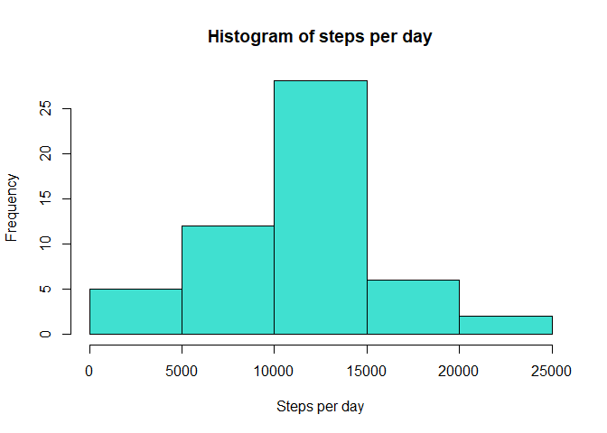
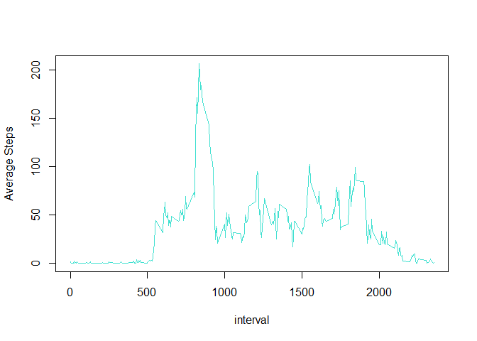
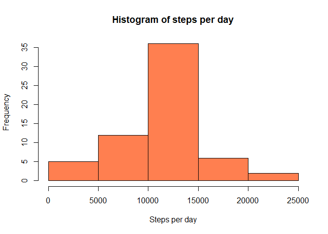
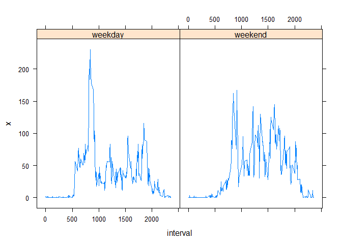

## Loading and preprocessing the data
The first step is to download the data, load it, and convert the date variable
to a date class.


```r
url <- "https://d396qusza40orc.cloudfront.net/repdata%2Fdata%2Factivity.zip"
download.file(url, destfile="repdata.zip")
unzip("repdata.zip")
activity <- read.csv("activity.csv",header=TRUE)
activity$date <- as.Date(activity$date)
```


## What is mean total number of steps taken per day?
1. Calculate total number of steps per day.

```r
steps_per_day <- aggregate(activity$steps, by=list(date=activity$date), FUN = sum)
```

2. Make a histogram of the total number of steps taken each day.

```r
hist(steps_per_day$x, xlab="Steps per day", main="Histogram of steps per day",
     col = "turquoise")
```

<!-- -->

3. Calculate and report mean and median steps per day.

```r
mean1 <- mean(steps_per_day$x, na.rm=TRUE)
mean1
```

```
## [1] 10766.19
```

```r
median1 <- median(steps_per_day$x, na.rm=TRUE)
median1
```

```
## [1] 10765
```

## What is the average daily activity pattern?
1. Plot a time series of the average activity for 5 minute intervals.


```r
avg_steps_interval <- aggregate(activity$steps, 
                                by = list(interval=activity$interval), 
                                FUN = mean, na.rm=TRUE)
plot(x ~ interval, data=avg_steps_interval, type="l", ylab="Average Steps",
     col="turquoise")
```

<!-- -->


2. Which 5-minute interval, on average across all the days in the dataset, contains the maximum number of steps?

```r
avg_steps_interval$interval[which.max(avg_steps_interval$x)]
```

```
## [1] 835
```

## Imputing missing values
1.Calculate and report the total number of missing values in the dataset (i.e. the total number of rows with NAs

```r
sum(is.na(activity$steps))
```

```
## [1] 2304
```

2. Replace NAs with the average steps for the corresponding interval.  
3. Create a new dataframe for the new values.

```r
activity2 <- activity
for (i in which(is.na(activity$steps))){
       activity2$steps[i] <- avg_steps_interval$x[which(avg_steps_interval$interval 
                                                       == activity$interval[i])]
}
```

4. Make a histogram, calculate mean and median.

```r
steps_per_day2 <- aggregate(activity2$steps, by=list(date=activity2$date), FUN = sum)
hist(steps_per_day2$x, xlab="Steps per day", main="Histogram of steps per day",
     col = "coral")
```

<!-- -->

```r
mean2 <- mean(steps_per_day2$x, na.rm=TRUE)
mean2
```

```
## [1] 10766.19
```

```r
median2 <- median(steps_per_day2$x, na.rm=TRUE)
median2
```

```
## [1] 10766.19
```

```r
mean2 - mean1
```

```
## [1] 0
```

```r
median2 - median1
```

```
## [1] 1.188679
```

## Are there differences in activity patterns between weekdays and weekends?
1. Create a new factor variable in the dataset with two levels – “weekday” and “weekend” indicating whether a given date is a weekday or weekend day.


```r
weekends <- c("Saturday","Sunday")
activity2$wknd_wday <- factor(weekdays(activity2$date) %in% weekends,
                              levels=c(FALSE, TRUE), labels= c("weekday","weekend"))
```

2.Make a panel plot containing a time series plot  of the 5-minute interval (x-axis) and the average number of steps taken, averaged across all weekday days or weekend days (y-axis). 


```r
steps_wknd_wkday <- aggregate(activity2$steps, by= list(wknd_wday=activity2$wknd_wday,
                                                        interval=activity2$interval),
                                                        FUN = mean)
library(lattice)
xyplot(x ~ interval | wknd_wday, data=steps_wknd_wkday, type="l")
```

<!-- -->
